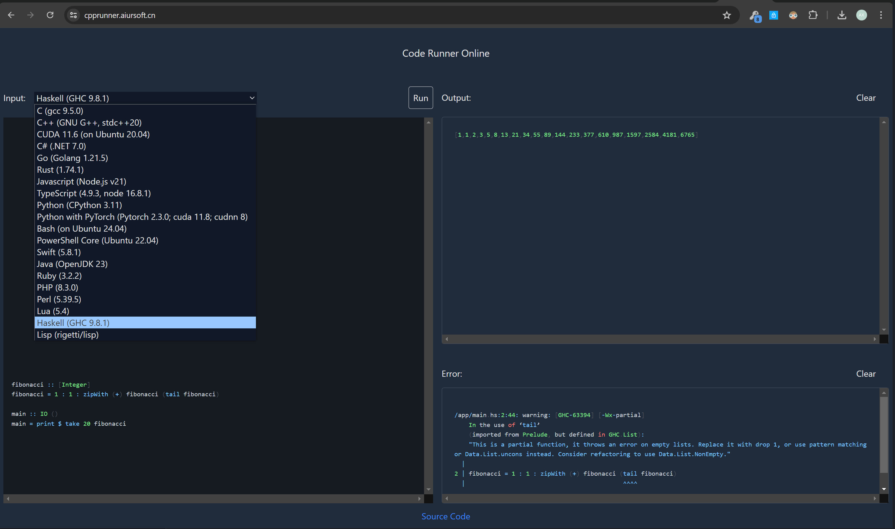

# CppRunner

[](https://gitlab.aiursoft.cn/aiursoft/cpprunner/-/blob/master/LICENSE)
[](https://gitlab.aiursoft.cn/aiursoft/cpprunner/-/pipelines)
[](https://gitlab.aiursoft.cn/aiursoft/cpprunner/-/pipelines)
[](https://gitlab.aiursoft.cn/aiursoft/cpprunner/-/commits/master?ref_type=heads)
[](https://cpprunner.aiursoft.cn)
[](https://hub.aiursoft.cn/#!/taglist/aiursoft/cpprunner)

CppRunner is a simple Web app that can run code for you. It's based on .NET and Docker. With CppRunner, you can start testing a piece of code in seconds without setting up your environment. Now supports 15 languages.



## Try

Try a running CppRunner [here](https://cpprunner.aiursoft.cn).

## Run in Ubuntu

The following script will install\update this app on your Ubuntu server. Supports Ubuntu 22.04.

On your Ubuntu server, run the following command:

```bash
curl -sL https://gitlab.aiursoft.cn/aiursoft/cpprunner/-/raw/master/install.sh | sudo bash
```

Of course it is suggested that append a custom port number to the command:

```bash
curl -sL https://gitlab.aiursoft.cn/aiursoft/cpprunner/-/raw/master/install.sh | sudo bash -s 8080
```

It will install the app as a systemd service, and start it automatically. Binary files will be located at `/opt/apps`. Service files will be located at `/etc/systemd/system`.

## Run manually

Requirements about how to run

1. Install [Docker](https://www.docker.com/)
2. Install [.NET 8 SDK](http://dot.net/) and [Node.js](https://nodejs.org/).
3. Configure `www-data` user in your host machine to allow access to Docker with: `sudo usermod -aG docker www-data`
4. Add `www-data` home: `sudo mkdir /var/www && sudo chown www-data:www-data /var/www`
5. Run `npm install`   in `src/Aiursoft.CppRunner.FrontEnd` folder.
6. Run `npm run build` in `src/Aiursoft.CppRunner.FrontEnd` folder.
7. Copy `src/Aiursoft.CppRunner.FrontEnd/dist` folder to `src/Aiursoft.CppRunner/wwwroot` folder.
8. Execute `sudo -u www-data dotnet run` as www-data user in the project path.
9. Use your browser to view [http://localhost:5000](http://localhost:5000).

## Run in Docker

First, install Docker [here](https://docs.docker.com/get-docker/).

Then run the following commands in a Linux shell:

```bash
mkdir -p /tmp/cpprunner/builds
image=hub.aiursoft.cn/aiursoft/cpprunner
appName=cpprunner
sudo docker pull $image
# Must run with root or you may have trouble passthrough the /tmp folder.
sudo docker run -d --name $appName --restart unless-stopped -p 5000:5000 -v /var/www/$appName:/data -v /tmp:/tmp -v /var/run/docker.sock:/var/run/docker.sock $image
```

That will start a web server at `http://localhost:5000` and you can test the app.

The docker image has the following context:

| Properties  | Value                                  |
|-------------|----------------------------------------|
| Image       | hub.aiursoft.cn/aiursoft/cpprunner     |
| Ports       | 5000                                   |
| Binary path | /app                                   |
| Data path   | /data                                  |
| Config path | /data/appsettings.json                 |
| Passthrough | /var/run/docker.sock (For Docker)      |
| Passthrough | /tmp/cpprunner/builds (For code)       |

## Run in Microsoft Visual Studio

1. Open the `.sln` file in the project path.
2. Press `F5` to run the app.

## How to contribute

There are many ways to contribute to the project: logging bugs, submitting pull requests, reporting issues, and creating suggestions.

Even if you with push rights on the repository, you should create a personal fork and create feature branches there when you need them. This keeps the main repository clean and your workflow cruft out of sight.

We're also interested in your feedback on the future of this project. You can submit a suggestion or feature request through the issue tracker. To make this process more effective, we're asking that these include more information to help define them more clearly.